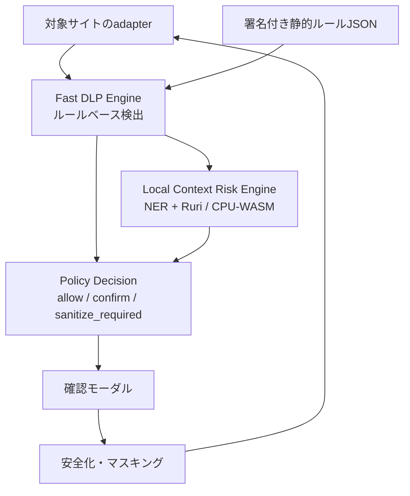
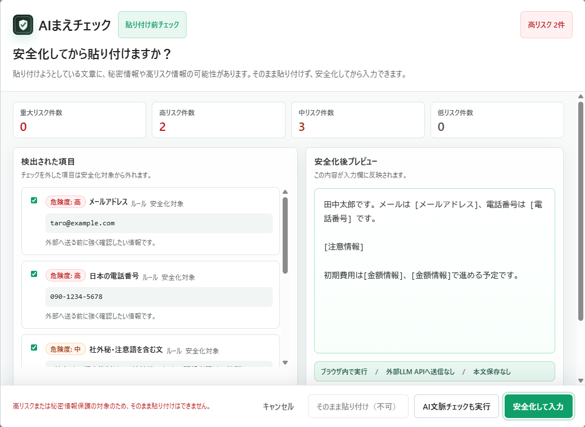
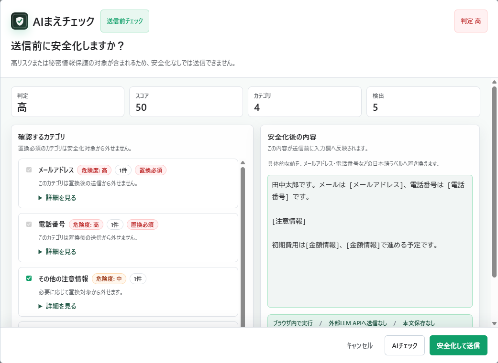

# AIまえチェック

> AIに送る前に、消し忘れを見つける。

AIまえチェックは、ChatGPT、Claude、Gemini、Perplexityへ文章を貼り付ける前・送信する前に、個人情報、秘密情報、APIキー、社外秘らしい内容に気づくためのChrome拡張です。プロダクト本体は拡張機能であり、公開サイトのデモは導入前に動きを確認するための補助アプリです。

## 作った理由

生成AIへ相談する内容が業務に近づくほど、入力欄には連絡先、顧客名、案件名、契約条件、採用評価などが混ざりやすくなります。一方、送信後に気づいても取り消せない場合があります。そこで、AIサービス自体を置き換えるのではなく、既存の入力体験へ「送る直前の確認」を加える拡張機能として作りました。

本文を開発者サーバーへ集めないため、検出・安全化・補助的なAI判定をブラウザ内へ寄せています。バックエンド推論費用を持たずに運用できますが、第三者のモデル配信元とユーザー端末の保存容量・CPU性能には依存します。

## 解決したい課題

AIへ相談する文章には、メールアドレス、電話番号、顧客名、社内URL、契約金額、採用情報、APIキーなどが意図せず混ざります。AIまえチェックは、送信直前の確認レイヤーとして、ユーザーが安全化内容を確認する時間を作ります。

これはChatGPTの下位互換ではありません。文章を生成するサービスではなく、AIへ貼る前のブラウザ内DLP補助ツールです。

## 主な機能

- ChatGPT、Claude、Gemini、Perplexityの貼り付け前・送信前チェック
- メール、電話、JWT、APIキー、秘密鍵、`.env`、Basic認証URL、カード番号、URL、IP、金額、注意語などのルール検出
- 高リスク情報や秘密情報保護対象の安全化必須判定
- 中リスク候補の詳細確認とユーザー選択
- 小型日本語NERによる人名、組織名、場所、施設、製品、イベント候補
- Ruri-v3-30mによる契約、人事、法務、財務、社内、未公開などの文脈候補
- 候補をチェックボックスで選び、安全化して入力
- 対象サイト、ルール、AI文脈チェックの設定
- 署名付き静的ルール配信の検証
- ユーザー本文を永続保存しない設計

## 使用イメージ

1. 対象サイトへ文章を貼り付ける、または送信する。
2. ルールベース検出がブラウザ内ですぐに実行される。
3. 必要に応じてAI文脈チェックを実行する。
4. 検出結果と安全化後プレビューを確認する。
5. ユーザーが選択した候補だけを安全化して入力する。

## AI文脈チェック

### 役割分担

ルールベース検出が主役です。メールアドレス、電話番号、APIキー、JWT、秘密鍵など確定的に判定しやすい情報はルールで検出します。

AI文脈チェックは、ルールだけでは拾いにくい候補を補います。

- `jiting/xlm-roberta-ner-japanese_onnx` q8（revision `8d70fc4d277a84e59ccc70520ffd9daff66e66f0`）: 人名、組織名、場所、施設、製品、イベントなどの実体候補
- `sirasagi62/ruri-v3-30m-ONNX` q8（revision `cdf9391f1ff2198daa8f63f7ccf97d7b3e7415a0`）: 契約、人事、法務、財務、社内、未公開、機密文脈などの候補

どちらもTransformers.js + ONNX Runtime WebのCPU/WASMで実行します。生成LLMではなく、文章生成、要約、依頼文生成、JSON解析は行いません。AI結果は候補であり、確定判定や安全の保証ではありません。

### モデル取得と制限

AI文脈チェックの初回利用時には、第三者のモデル配信元からモデルファイルを取得する場合があります。取得後はブラウザキャッシュや管理下の保存領域を利用します。モデルファイルは合計で大きくなる場合があり、保存容量、端末メモリ、CPU、ネットワーク制限によって利用できないことがあります。NERまたはRuriの片方だけが失敗した場合は部分結果を表示し、両方が失敗してもルールベース検出を維持します。

モデルの選定理由とライセンスは [ローカルAIモデル選定](docs/local-ai-model-policy.md) と [NOTICE](NOTICE) に記載しています。WebLLMとWebGPUは現行機能ではありません。

## プライバシー設計

- 貼り付け本文、送信本文、ファイル本文、検出結果、placeholderMapを永続保存しない
- 設定と検証済み署名付きルールキャッシュだけを `chrome.storage.local` に保存
- ユーザー本文を外部LLM API、開発者サーバー、ルール配信サーバーへ送信しない
- AI推論はユーザーのブラウザ内で実行する
- ユーザー本文をconsole.logやエラー詳細へ出力しない
- Analyticsやトラッキングを入れない
- サポート報告や公開Issueに実APIキー、実トークン、実個人情報を含めない

ただし、モデルファイルの取得先、ブラウザのキャッシュ、保存容量、端末環境には依存します。安全を保証する製品ではなく、検出漏れや誤検出の可能性があります。

## アーキテクチャ



## ディレクトリ構成

```text
harumae/
  apps/extension/   Chrome拡張、adapter、送信前確認UI
  apps/site/        紹介LP、プライバシー、サポート、ミニデモ
  packages/core/    ルール検出、マスキング、ポリシー、型
  packages/llm/     NER、Ruri、CPU/WASM Worker、候補変換
  docs/             設計、QA、公開・運用手順
  scripts/          ビルド、ルール署名、QA
```

## 技術スタック

TypeScript、pnpm workspace、React、WXT、Vite、Tailwind CSS、React Aria、Vitest、Playwright、Chrome Extension Manifest V3、Transformers.js、ONNX Runtime Web、Web Worker、WebAssembly、`chrome.storage.local`、GitHub Pages、GitHub Actionsを使用します。

## セットアップ

```bash
pnpm install
pnpm dev:extension
pnpm dev:site
```

### Chrome拡張の読み込み

1. `pnpm build:extension` を実行する。
2. Chromeで `chrome://extensions` を開き、デベロッパーモードを有効にする。
3. 「パッケージ化されていない拡張機能を読み込む」から `apps/extension/.output/chrome-mv3` を選ぶ。
4. 対象サイトのタブを再読み込みする。

### デモサイトの起動

`pnpm dev:site` を実行し、表示されたローカルURLを開きます。公開版はGitHub Pagesで配信します。ミニデモは拡張と同じ `packages/core` と `packages/llm` を使いますが、Chrome拡張そのものの代替ではありません。

## 開発コマンド

```bash
pnpm test
pnpm typecheck
pnpm lint
pnpm build
pnpm qa:local-ai-model-policy
pnpm qa:local-ai-compatibility
```

CPU/WASMモデルの実ロードは通常のCIテストに必須とせず、Workerと推論結果をモックしたテストを実行します。実モデルは [ローカルAI実機確認メモ](docs/local-ai-real-device-check.md) に沿って手動確認します。

## 検出対象と制限

確定情報はルールベースで検出します。AIは人名、組織名、場所、施設、製品、イベント、契約、人事、法務、財務、社内、未公開などの候補を補助します。検出漏れ・誤検出、固有名詞の取りこぼし、住所の部分検出があり得ます。PDF、docx、xlsx、画像OCRなどのファイル内容は安全判定済みとして扱いません。対応していないファイルは安全判定済みとは扱いません。外部OCR APIを使わない方針のため、画像OCRは現時点では実装しない判断です。

本ツールは情報漏洩を完全に防ぐものではありません。最終的に送信するかどうかはユーザーが判断してください。

## 実装上の前提・制限

- 対象サイトのDOM変更により、入力欄や送信操作を検知できなくなる可能性がある
- AI候補は誤検出・検出漏れがあり、送信可否の確定判定には使わない
- Ruriは文単位の意味分類、NERは固有表現候補、ルールは確定情報という役割に分ける
- 同じ文字列が複数回現れるAI候補は、入力中で確認できた各範囲を候補化する
- AI候補の上位カテゴリ差が小さい場合は、曖昧な分類として表示しない
- 初回モデル取得は合計320MBを超える場合があり、完了まで時間がかかる
- Chromeのシークレットウィンドウや保存容量の少ない環境ではモデルキャッシュを確保できない場合がある
- モデル取得やAI判定が失敗しても、ルールベース検出は継続する
- 添付ファイルは対応形式と読み取れたテキストだけを対象とし、画像OCRは行わない
- 検出結果、安全化対応表、本文、送信履歴は永続保存しない

## ルール配信

追加ルールはGitで管理し、CIで検証したうえでGitHub Pagesの署名付き静的JSON `GET /rules/latest.json` として配信します。拡張機能は公開鍵で署名を検証し、検証に失敗したルールを適用しません。本文はルール配信へ送信しません。

## ドキュメント

- 公開サイト: https://shunya-mabuchi.github.io/ai-mae-check/
- サポート: https://shunya-mabuchi.github.io/ai-mae-check/support/
- プライバシー: https://shunya-mabuchi.github.io/ai-mae-check/privacy/
- [ローカルAIモデル選定](docs/local-ai-model-policy.md)
- [ローカルAI互換性マトリクス](docs/local-ai-compatibility-matrix.md)
- [ローカルAI実機確認](docs/local-ai-real-device-check.md)
- [ローカルAIエラー復旧](docs/local-ai-error-recovery.md)
- [性能基準](docs/performance-budget.md)
- [Chrome拡張E2Eハーネス](docs/extension-e2e-harness.md)
- [ポートフォリオ・ケーススタディ](docs/portfolio-case-study.md)
- [プライバシーポリシー](docs/privacy-policy.md)
- [脅威モデル](docs/threat-model.md)
- [サイトadapter契約](docs/site-adapter-contract.md)
- [検出ルール作成ガイド](docs/detection-rule-authoring.md)
- [第三者ライセンス告知](NOTICE)
- [変更履歴](CHANGELOG.md)
- [Chrome Web Store](https://chrome.google.com/webstore/detail/idedmkfplfieijdcflcogkngplhkkecc)

## 公開状況

Chrome Web Storeの公開版は `0.2.0` です。2026年8月8日に公開を確認しました。

## ポートフォリオとして

Chrome Web Storeで公開するChrome拡張を本体に、ルールベースDLP、ポリシー判定、CPU/WASMローカルAI、署名付きルール配信、プライバシー設計、実サイトQA、CIを組み合わせています。バックエンドやユーザー本文のデータベースを持たず、必要な処理をブラウザ内で完結させる設計判断も含めて公開しています。

## 今後追加したい機能

- 対象サイトadapterの継続的なDOM互換性検証
- 日本語NERとRuri分類のfixture拡充、閾値評価、誤検出率の可視化
- 署名付きルールの更新・ロールバック運用の自動化
- 対応可能なテキストファイル形式の拡充
- モデル配信元障害時の説明と復旧導線の改善

## スクリーンショット

### 貼り付け前確認



### 送信前確認



### AI文脈チェック


